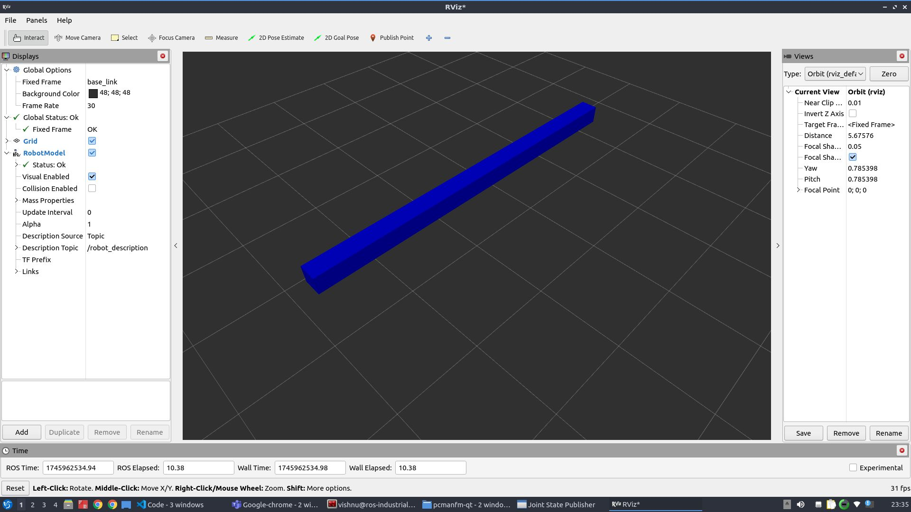
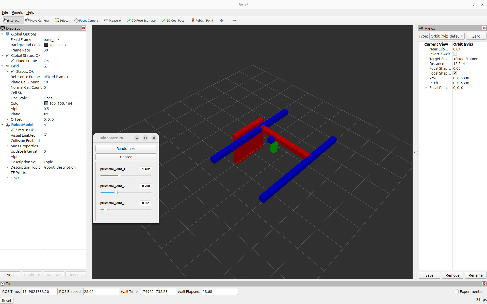

# Cartesian Robot Tutorial


## Introduction

This tutorial is designed to guide you through the process of building a simple Cartesian robot model using URDF (Unified Robot Description Format) and xacro within the ROS 2 Jazzy environment. The aim is to understand how to describe a robot’s physical structure and behavior in simulation using ROS tools, and how to visualize it using RViz2.

A Cartesian robot moves linearly along the X, Y, and Z axes. It is widely used in applications like 3D printing, CNC machines, and pick-and-place systems. Among other advantages, this mechanical arrangement simplifies the robot control arm solution. It has high reliability and precision when operating in three-dimensional spac.  Because of its straightforward design, it's a great choice for beginners to learn the basics of robot modeling.

This tutorial focuses on creating a robot with prismatic joint, where the link length can be customized through a xacro parameter. This teaches how to build modular, adaptable robot descriptions suitable for more advanced scenarios later.

### What You'll Learn:

- How to structure a robot model using URDF.

- How to use xacro to create reusable and configurable URDF files.

- How to launch and visualize your robot model in RViz2.

- How to parameterize robot features like link lengths for flexibility.

***Note: This tutorial is written for ROS2 Jazzy, so make sure your development environment is set up with this version***

## Task

### 1. Create Package

Create the directory: 


```bash 
mkdir urdf_tutorials/src
```

then create the package
```bash 
cd urdf_tutorials/src
ros2 pkg create cartesian_robot_description --build-type ament_cmake 
cd cartesian_robot_description
```

### 2. Update `CMakeLists.txt` and `package.xml`

In `CMakeLists.txt` make sure to add this to access the urdf and launch file.

```bash
install(DIRECTORY launch
  DESTINATION share/${PROJECT_NAME}/
)

install(DIRECTORY urdf
  DESTINATION share/${PROJECT_NAME}/
)
```

In `package.xml`, make sure you declare dependencies on:


```bash
  <exec_depend>xacro</exec_depend>
  <exec_depend>robot_state_publisher</exec_depend>
  <exec_depend>rviz2</exec_depend>
```

### 3. Creating the launch file

#### Step 1: Creating the launch file.

Inside the package `cartesian_robot_description` create the `launch`folder to keep the launch file.


```bash
mkdir launch
cd launch
```

Inside the `launch` folder now create the file `cartesian_robot_view.launch.py`.

#### Step 2: Add the Required Modules.

Iside the launch file start with adding the required modules:

```bash
from launch import LaunchDescription
from launch.actions import DeclareLaunchArgument, TimerAction
from launch.substitutions import LaunchConfiguration, Command PathJoinSubstitution
from launch_ros.actions import Node
from launch_ros.substitutions import FindPackageShare
```

- These modules let you define launch arguments, time delays and ROS2 nodes dynamically.

#### Step 3: Define the Launch Description function.

```bash
def generate_launch_description():
```

This is the function the launch system will call when the file is executed.


#### Step 4: Locate and process the URDF file using xacro

Use `PathJoinSubstitution` to build the path to the `cartesian_urdf.xacro` file inside the urdf folder.

```bash
    urdf_path = PathJoinSubstitution([
        FindPackageShare('cartesian_robot_description'),
        'urdf',
        'cartesian_urdf.xacro'
    ])
```

Then use the `xacro` command to convert it to a proper URDF string at launch time:

```bash
    robot_description = Command([
        'xacro', ' ', urdf_path
    ])
```

This enables parameter substitution and reusability, and ensures that xacro is executed when the robot launches.


#### Step 5: Launch the joint state publisher GUI

This node provides sliders to simulate joint positions interactively.

```bash
 Node(
        package='joint_state_publisher_gui',
        executable='joint_state_publisher_gui',
        name='joint_state_publisher_gui',
        output='screen'
    )
 ```   

#### Step 6: Launch the robot state publisher

This node takes the joint states and URDF and publishes the full robot state to TF.

```bash
    Node(
        package='robot_state_publisher',
        executable='robot_state_publisher',
        parameters=[{'robot_description': robot_description}],
        output='screen'
    )
```    

#### Step 7: Delay and launch RViz

We delay RViz launch by 1 second using TimerAction to ensure everything is ready before visualizing.

```bash
    TimerAction(
        period=1.0,
        actions=[
            Node(
                package='rviz2',
                executable='rviz2',
                name='rviz2',
                output='screen'
            )
        ]
    )
```

#### Step 8: Return all nodes and actions in the launch description

Finally, all defined nodes and actions are put together as part of the launch description.

```bash
    return LaunchDescription([
        ... all nodes/actions ...
    ])
```

The complete launch file can be found here: [cartesian_robot_view.launch.py](https://gitlab.cc-asp.fraunhofer.de/ipa326/ros_training_workspaces/cartesian_robot_tutorial/-/blob/main/cartesian_robot_description/launch/cartesian_robot_view.launch.py?ref_type=heads).


### 4. Build the package

Return to your workspace root and build your package:

```bash
cd ~/urdf_tutorials
colcon build --symlink-install
source install/setup.bash
```

### 5. Creating URDF file

#### Step 1: Creating the Xacro file.

Inside the package `cartesian_robot` create the urdf folder keep the urdf of the robot.

```bash
mkdir urdf
cd urdf
```

Inside the `urdf` folder now create the file `cartesian_urdf.xacro` which will define all the joints and links and which contains all the parameters that can be changed as required.

Add the following line to the top of the code.

```bash
<?xml version="1.0"?>
<robot xmlns:xacro="http://ros.org/wiki/xacro" name="cartesian_robot">
```

This declares the robot and enables Xacro macros.

#### Step 2: Defining colours(Materials)

```bash
<material name="blue">
  <color rgba="0 0 1 1" />
</material>

<material name="red">
  <color rgba="1 0 0 1" />
</material>

<material name="green">
  <color rgba="0 1 0 1" />
</material>
```

These materials will help to visualise the robot parts in RViz.

#### Step 3: Add Configurable parameters.

```python
<xacro:property name="z_offset" value="1.0" />
  <xacro:property name="l1" value="4.0" />
  <xacro:property name="l2" value="2.4" />
  <xacro:property name="l3" value="0.8" />
  <xacro:property name="l4" value="0.2" />
  <xacro:property name="width" value="0.2" />
  <xacro:property name="holder_offset" value="${z_offset + 0.5}"/>

```

These values define:
- A z-offset to lift the robot off the ground.
- Link Lenghts (l1,l2,l3..).
- width parameter to set a varying width of link if required.
- holder_offset to make the cartesian robot fixed to ground in gazebo.

These parameters can be modified as required and also they make the model reconfigurable.

#### Step 4: Add the Base Link

```bash
<link name="base_link" />
```

This is the root of the robot, a fixed reference point.


#### Step 5: Defining a link

```bash
  <link name="link1">
    <inertial>
     <origin xyz="0 0 0" rpy="0 0 0"/>
     <mass value="1"/>
     <inertia ixx="100"  ixy="0"  ixz="0" iyy="100" iyz="0" izz="100" />          
    </inertial>
    <visual>
      <origin xyz="0 0 0" rpy="0 0 0" />
      <geometry>
        <box size="${l1} ${width} ${width}" />
      </geometry>
      <material name="blue" />
    </visual>
  </link>
```

```bash
<link name="link2">
    <inertial>
      <origin xyz="0 0 0" rpy="0 0 0"/>
      <mass value="1"/>
      <inertia ixx="1000"  ixy="0"  ixz="0" iyy="1000" iyz="0" izz="1000" />          
     </inertial>
    <visual>
      <origin xyz="0 ${l2/2} 0" rpy="0 0 0" />
      <geometry>
        <box size="${width} ${l2} ${width}" />
      </geometry>
      <material name="red" />
    </visual>
  </link>
```

After creating each link it can be viewed in RViz by reffering `6. Visualising the robot in RViz`.

Rviz visualisation after the link1 will look like:


Repeat this structure for define other links ,adjusting visual geometry and colors to match their function. After each link, it can be visualised in Rviz for better understanding.

The complete URDF with all links defined can be viewed in [Cartesian_urdf.xacro](https://github.com/VSP-AR/urdf_tutorials/blob/main/cartesian_robot/urdf/cartesian_urdf.xacro).

#### Step 6: Add Joints

Fixed joint example:

```bash
 <joint name="fixed_link_1" type="fixed">
    <parent link="base_link" />
    <child link="link1" />
    <origin xyz="0 0 ${z_offset}" rpy="0 0 0" />
  </joint>
```

This attaches link1 to the base with an offset.

Prismatic Joint Example:

```bash
  <joint name="prismatic_joint_1" type="prismatic">
    <parent link="link1" />
    <child link="link2" />
    <origin xyz="${-l1/2} 0 0" rpy="0 0 0" />
    <axis xyz="1 0 0" />
    <limit lower="0.0" upper="${l1}" effort="10" velocity="1.0" />
  </joint>
```
This joint allows linear motion in the x-direction.

Similarly other joints can be defined. Complete urdf can be found here [cartesian_urdf.xacro](https://gitlab.cc-asp.fraunhofer.de/ipa326/ros_training_workspaces/cartesian_robot_tutorial/-/blob/main/cartesian_robot_description/urdf/cartesian_urdf.xacro?ref_type=heads).

#### Step 7: Close the Robot tag

```bash
</robot>
```

### 6. Visualising the robot in rviz

***Note: Before running any launch files, make sure you source your workspace***

```bash
source ~/urdf_tutorials/install/setup.bash
```

After completing all the above steps, Run your launch file to start the robot_state_publisher and open RViz2:

```bash
ros2 launch cartesian_robot_description cartesian_robot_view.launch.py
```



This will launch rviz and the joint state publisher and this allows to interact with different joints.